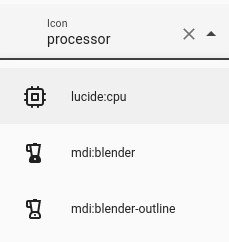

# hass-lucide-icons

This is custom component/integration enables the usage of the awesome [Lucide](https://lucide.dev/) icon pack.

Huge thanks to *Thomas Lovén* and his custom component [hass-fontawesome](https://github.com/thomasloven/hass-fontawesome), which helped me a lot to develop this icon set integration.

## Installation

### HACS

This intergation, will is not listed in HACS natively. For more details, please see [#5072](https://github.com/home-assistant/brands/pull/5072)

However, you can add it as a custom repository by:

[](https://my.home-assistant.io/redirect/hacs_repository/?category=Integration&owner=karlis-vagalis&repository=hass-lucide-icons)

Or by manually adding `Custom Repository` in HACS: `karlis-vagalis/hass-lucide-icons`.

### Manual

1. Copy `lucide_icons` folder to your custom components.
2. Restart Home Assistant
3. Install `Lucide Icons` component under Home Assistant > Integrations
4. Restart Home Assistant

## Development

If you are interested in the processing workflow done on the Lucide icons themselves to make them Home Assistant compatible, I wrote a small tutorial [here](https://karlislab.com/posts/tutorials/programming/hass-lucide-icons/) on my blog.

## Usage

This icon pack uses prefix `lucide` to access icons. For example:
```
lucide:trash

lucide:circle-dot

...
```

## Features

This icon pack integration also supports icon keywords, which means you can use keywords/aliases of the icons to search icons inside the native Home Assistant icon dialog. For example, icon `cpu` has additional aliases/keywords and one of them is `processor`. Therefore we may type `processor` in icon search bar in Home Assistant and voila, the correct icon is suggested as seen here:


